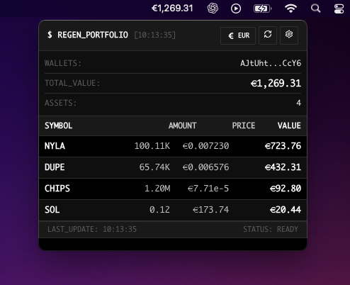

# 🌱 RegenPortfolio

A sleek, terminal-styled Solana portfolio tracker that lives in your system's menu bar. Built with React, Vite, and Electron for a native desktop experience. Making each user feel more like a $REGEN.

CA: 



## ✨ Features

### 🎯 Core Functionality
- **Menu Bar Integration**: Lives in your macOS menu bar/Windows system tray
- **Real-time Portfolio Tracking**: Shows total Solana portfolio value at all times
- **Multi-wallet Support**: Track multiple Solana wallet addresses simultaneously
- **Token & NFT Support**: Displays token balances, prices, and NFT counts
- **Live Updates**: Auto-refresh every 30-60 seconds (configurable)

### 💫 UI/UX Features
- **Terminal Aesthetic**: Beautiful retro terminal design with smooth animations
- **Privacy Mode**: Hide/show balance amounts with one click
- **Multi-currency Support**: USD, EUR, GBP, JPY with real-time conversion
- **Loading Animations**: Elegant shimmer effects during data fetching
- **Responsive Design**: Optimized for small menu bar windows

### ⚙️ Settings & Configuration
- **API Key Management**: Secure storage for Helius and Moralis API keys
- **Wallet Management**: Add/remove/enable/disable wallet addresses
- **Refresh Intervals**: Customize how often data refreshes (30s - 10min)
- **Currency Preferences**: Choose your preferred display currency

## 🚀 Getting Started

### 📦 Current Build Status
- **✅ macOS**: `.dmg` installer available
- **🔄 Windows**: `.exe` installer (builds available)
- **🔄 Linux**: `.AppImage` installer (builds available)

> **Note**: Currently, only the macOS build has been tested and released. Windows and Linux builds are configured and will be available in future releases.

### Prerequisites
- **macOS**: macOS 10.14 or later
- **Windows**: Windows 10 or later
- **Linux**: Ubuntu 18.04+, Fedora 28+, or similar
- **API Keys**: 
  - Helius API key (free at [helius.xyz](https://helius.xyz))
  - Moralis API key (free at [moralis.io](https://moralis.io))

### System Requirements
- **Minimum RAM**: 512MB
- **Storage**: 100MB free space
- **Network**: Internet connection for API calls
- **Display**: 1024x768 minimum resolution

### Download & Install

#### Option 1: Download Pre-built App (Recommended)
Download the latest release for your platform:

- **macOS**: Download `RegenPortfolio-1.0.0.dmg` ✅ **Available Now**
- **Windows**: Download `RegenPortfolio-1.0.0.exe` 🔄 **Coming Soon**
- **Linux**: Download `RegenPortfolio-1.0.0.AppImage` 🔄 **Coming Soon**

> **Current Status**: Only macOS builds are currently available. Windows and Linux builds will be released in future updates.

1. **Download** the appropriate file for your operating system
2. **Install**:
   - **macOS**: Open `.dmg` file and drag to Applications folder
   - **Windows**: Run `.exe` installer and follow prompts *(Coming Soon)*
   - **Linux**: Make `.AppImage` executable (`chmod +x`) and run *(Coming Soon)*
3. **Launch** the app from your Applications/Start Menu
4. **Configure** API keys and add wallet addresses (see First Time Setup below)

#### Option 2: Build from Source
For developers or if you want the latest features:

1. **Clone the repository**:
   ```bash
   git clone https://github.com/yourusername/RegenPortfolio.git
   cd RegenPortfolio
   ```

2. **Install dependencies**:
   ```bash
   npm install
   ```

3. **Get your API keys**:
   - Visit [helius.xyz](https://helius.xyz) for free Helius API key
   - Visit [moralis.io](https://moralis.io) for free Moralis API key

### Running the App

#### Development Mode (Build from Source)
```bash
npm run dev
```
This starts the Vite dev server for web development.

#### Electron Development Mode (Build from Source)
```bash
npm run electron-dev
```
This starts both the Vite dev server and Electron app.

#### Production Build (Build from Source)
```bash
npm run build
npm run electron-pack
```

#### Distribution Build (Build from Source)
```bash
npm run dist
```
Creates platform-specific installers in the `dist` folder:
- **macOS**: `RegenPortfolio-1.0.0.dmg`
- **Windows**: `RegenPortfolio-1.0.0.exe` 
- **Linux**: `RegenPortfolio-1.0.0.AppImage`

## 📱 First Time Setup

1. **Launch the app** - The settings panel will open automatically
2. **Configure API Keys**:
   - Click on the "API_KEYS" tab
   - Enter your Helius API key
   - Enter your Moralis API key
   - Click "SAVE_API_KEYS"
3. **Add Wallet Addresses**:
   - Switch to the "WALLETS" tab
   - Enter your Solana wallet address(es)
   - Click "ADD" for each wallet
4. **Configure preferences** (currency, refresh interval)
5. **Your portfolio will load automatically** once setup is complete

## 🎮 Usage

### Platform Support
- **macOS**: Full menu bar integration with native macOS tray
- **Windows**: System tray integration with Windows notification support
- **Linux**: AppIndicator support for various desktop environments

### Menu Bar / System Tray
- **Click the tray icon** to open/close the portfolio window
- **Right-click the tray icon** for context menu (Refresh, Settings, Quit)
- **Tooltip** shows current total portfolio value
- **Platform-specific features**:
  - **macOS**: Native menu bar with dark mode support
  - **Windows**: System tray with Windows 10/11 styling
  - **Linux**: AppIndicator compatible with GNOME, KDE, etc.
- **Eye icon**: Toggle balance visibility (privacy mode)
- **Refresh icon**: Manual refresh of portfolio data
- **Settings icon**: Open settings panel
- **Currency selector**: Change display currency
- **Token list**: View all tokens with amounts and values

### Settings Panel
- **API Keys**: Manage your Helius and Moralis API keys (stored securely locally)
- **Wallets**: Add/remove/enable wallet addresses
- **Display**: Choose currency and refresh interval
- **Status**: View configuration status and wallet counts

## 🔌 API Integration

This app uses two APIs for comprehensive Solana blockchain data:

### Helius API
- SOL balance and RPC calls
- Token metadata and balances
- Real-time blockchain data

### Moralis API
- SPL token balances
- Token price data
- NFT collection information

**Your API keys are stored locally and never shared.** The app makes direct API calls from your machine.

## 🏗️ Architecture

```
├── electron/           # Electron main process
│   ├── main.js        # Main process with tray functionality
│   └── preload.js     # Secure IPC bridge
├── src/
│   ├── components/    # React components
│   │   ├── PortfolioDisplay.jsx
│   │   ├── SettingsPanel.jsx
│   │   ├── SimplePortfolio.jsx
│   │   └── WalletInput.jsx
│   ├── services/      # Business logic
│   │   ├── heliusApi.js    # Helius API integration
│   │   ├── currencyService.js # Currency conversion
│   │   └── storage.js      # Local storage management
│   ├── App.jsx        # Main React app
│   └── main.jsx       # React entry point
├── public/            # Static assets
└── dist/              # Build output
```

## 🛠️ Tech Stack

- **Frontend**: React 18, Vite
- **Desktop**: Electron
- **Styling**: CSS3 with terminal theme
- **APIs**: Helius, Moralis, DexScreener, Jupiter
- **Storage**: LocalStorage for settings persistence

## 🔧 Development

### Project Structure
- **Component-based architecture** with clear separation of concerns
- **Service layer** for API interactions and business logic
- **Local storage** for user preferences and wallet data
- **Terminal UI theme** throughout the application

### Key Features
- **Real-time data fetching** with configurable intervals
- **Error handling** with user-friendly messages
- **Responsive design** for various screen sizes
- **Cross-platform compatibility** (macOS, Windows, Linux)

### Building for Different Platforms

#### macOS Build
```bash
npm run dist
# Output: dist/RegenPortfolio-1.0.0.dmg
```

#### Windows Build (requires Windows or WSL)
```bash
npm run dist
# Output: dist/RegenPortfolio-1.0.0.exe
```

#### Linux Build
```bash
npm run dist
# Output: dist/RegenPortfolio-1.0.0.AppImage
```

#### All Platforms (requires cross-compilation setup)
```bash
# Build for all platforms at once
npm run dist
# Outputs: .dmg, .exe, and .AppImage files
```

## 🤝 Contributing

1. Fork the repository
2. Create your feature branch (`git checkout -b feature/AmazingFeature`)
3. Commit your changes (`git commit -m 'Add some AmazingFeature'`)
4. Push to the branch (`git push origin feature/AmazingFeature`)
5. Open a Pull Request

## 📞 Support

- **Issues**: [GitHub Issues](https://github.com/yourusername/RegenPortfolio/issues)
- **Discussions**: [GitHub Discussions](https://github.com/yourusername/RegenPortfolio/discussions)
- **Wiki**: [Project Wiki](https://github.com/yourusername/RegenPortfolio/wiki)

## 🙏 Acknowledgments

- [Helius](https://helius.xyz) for Solana RPC and API services
- [Moralis](https://moralis.io) for Web3 data APIs
- [Electron](https://electronjs.org) for cross-platform desktop apps
- [React](https://reactjs.org) for the UI framework
- [Vite](https://vitejs.dev) for the build tool

---

**Made with ❤️ for the Solana ecosystem**

## 📄 License

This project is licensed under the MIT License - see the [LICENSE](LICENSE) file for details.
